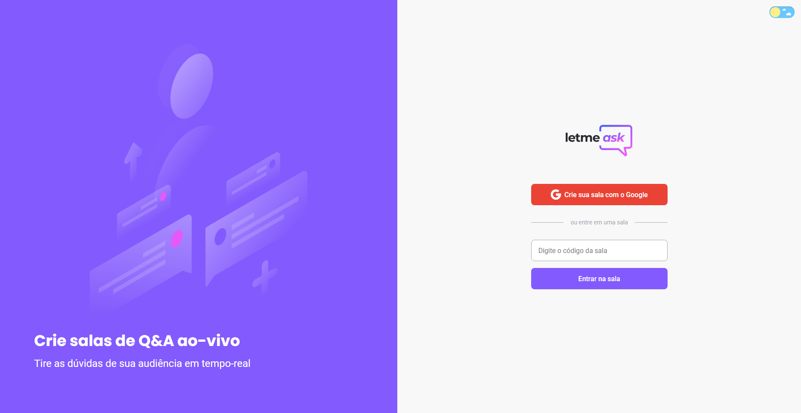

<h1 align="center">
    
</h1>

<br>

<p align='center'>
  <a href="#tecnologias">Tecnologias</a>&nbsp;&nbsp;&nbsp;|&nbsp;&nbsp;&nbsp;
  <a href="#sobre">Sobre</a>&nbsp;&nbsp;&nbsp;|&nbsp;&nbsp;&nbsp;
  <a href="#começando">Começando</a>&nbsp;&nbsp;&nbsp;|&nbsp;&nbsp;&nbsp;
  <a href="#layout">Layout</a>&nbsp;&nbsp;&nbsp;|&nbsp;&nbsp;&nbsp;
  <a href="#license">License</a>
</p>

<br>

<p align="center">
  
  
       

  
</p>

<br>


<br >

# 🤖 Tecnologias

As tecnologias usadas neste app foram:

* React
* Typescript
* Stitches
* Firebase
* react-hot-toast
* react-router-dom


<br>

# 💻 Sobre

Esta aplicação tem como público alvo criadores de conteúdo, onde irão criar salas de Q&A e as perguntas com mais curtidas terão destaque,podendo assim tirar dúvidas de seu público em tempo real.

Este é um projeto desenvolvido durante a **[Next Level Week Together](https://nextlevelweek.com/)**, apresentada dos dias 20 a 27 de Junho de 2021.


<br>


# 🚀 Começando

Este projeto foi criado a partir do [Create React App](https://github.com/facebook/create-react-app).

## Clone o projeto

Clone o projeto e acesse a pasta do mesmo.

```bash
$ git clone https://github.com/CrysLef/Letmeask
$ cd Letmeask
```
## Inicie o Projeto


Para iniciá-lo, siga os passos abaixo:

```bash
# Instalar as dependências
$ yarn

# Iniciar o projeto
$ yarn start
```

Abra este app no modo de desenvolvimento.\
Abra o [http://localhost:3000](http://localhost:3000) para abrir no seu browser.

A página irá recarregar assim que você fizer edições.\
Você também poderá ver os erros no console.

<br>

# 🖼️ Layout

O layout foi desenvolvido por [Rebecca Gonzalez](https://www.figma.com/@rebecca), para termos mais acessos aos seus detalhes, podemos encontrar o projeto dentro do Figma atráves deste [link](https://www.figma.com/community/file/1009824839797878169).



<br>

# 📝 Lincese

Este projeto está sobre a licença da MIT, caso queira saber mais detalhes, clique neste [link](LICENSE.md).

<br>

-----

Feito com 💜 por [Crystian](https://www.linkedin.com/in/crystian-lefundes/) !
